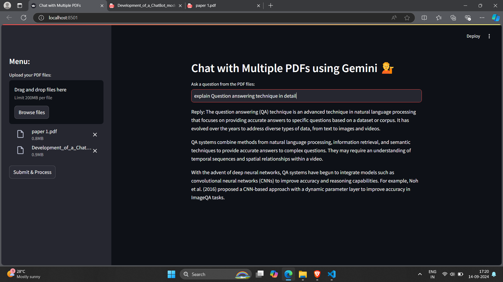

# Multiple PDF Chatbot

This project is a **Streamlit-based web application** that allows users to chat with multiple PDF documents by asking questions in natural language. It leverages **Google's Gemini model**, **FAISS** for vector-based similarity search, and **GooglePalmEmbeddings** to provide intelligent answers based on the uploaded PDF files.

## Features

- Upload multiple PDF files and extract their text.
- Split large documents into manageable text chunks for better question answering.
- Use FAISS to generate and store vector embeddings of the text chunks.
- Ask questions in natural language and receive accurate answers based on the context within the uploaded PDFs.
- Powered by **Google Generative AI API (Gemini)** and **FAISS** for high-quality conversational AI interactions.

## Installation

Follow these steps to install and run the project locally.

### Prerequisites

- Python 3.10+
- Google API Key (for using the Google Generative AI API and embeddings)

### Clone the Repository

```bash
git clone https://github.com/Gumdu777/multiple-pdf-chatbot.git
cd multiple-pdf-chatbot
```

### Create a Virtual Environment

It is recommended to create a virtual environment to manage dependencies.

```bash
python -m venv venv
source venv/bin/activate  # For Windows use: venv\Scripts\activate
```

### Install Dependencies

Install the necessary Python libraries by running:

```bash
pip install -r requirements.txt
```

### Setup Environment Variables

Create a `.env` file in the root directory of the project and add your **Google API Key**:

```bash
GOOGLE_API_KEY=your_google_api_key_here
```

> Make sure to replace `your_google_api_key_here` with your actual API key.

### Run the Application

Start the Streamlit app by running:

```bash
streamlit run app.py
```

Once the app is running, open your browser and navigate to `http://localhost:8501`.

## How It Works

### PDF Upload & Text Extraction

- Upload one or more PDF files through the sidebar.
- The application extracts text from each page of the uploaded PDFs using `PyPDF2`.
  
### Text Chunking

- The extracted text is split into smaller chunks using `RecursiveCharacterTextSplitter`. This ensures the chunks are of manageable size for embedding and processing.
  
### Vector Store Creation

- The text chunks are transformed into embeddings using **GooglePalmEmbeddings**.
- The embeddings are stored in a **FAISS vector store**, allowing for efficient similarity searches.

### Question Answering

- The user inputs a question, which is compared to the stored text chunks using FAISS's similarity search.
- Relevant text chunks are passed into a custom prompt template, and the answer is generated using **Google Gemini (ChatGooglePalm)**.
  
### Error Handling

- Comprehensive error handling is provided for file uploads, vector store creation, and question-answering operations.


## Technologies Used

- **Streamlit**: For building the web application interface.
- **GooglePalmEmbeddings**: For generating vector embeddings from text.
- **Google Generative AI API (Gemini)**: For answering questions based on the context of the uploaded PDFs.
- **FAISS**: For efficient similarity search across text chunks.
- **PyPDF2**: For extracting text from PDF documents.
- **LangChain**: For managing the chain of operations in question-answering.

## Screenshots

 

## Future Enhancements

- Support for additional file formats (e.g., DOCX, TXT).
- Improve the accuracy of answers by refining the prompt template.
- Enable caching for frequently asked questions.
- Add support for multi-user sessions.


